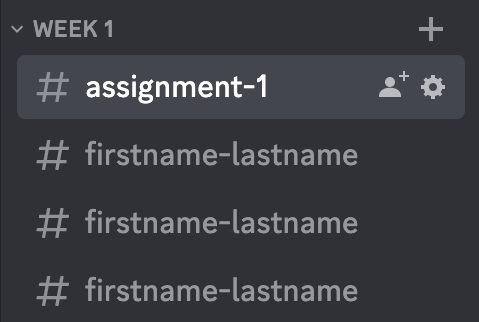

# Photo Gallery Building Discord Bot

This project is a Discord bot built in Rust. It was created as a project for my photography class and as a
way to practice the Rust programming language.

## Features

- The bot allows users to build a image gallery website by sending commands.
- The bot will build a static website that can be hosted by any basic webserver. (Includes a super simple python webserver)
- Downloads and scales images into local cache for faster page loading.

## Getting Started

To run this project, you will need to have Rust and Cargo installed on your machine. You will also need to create a
Discord bot and get its API token.

1. Invite your bot to your Discord server. 
   1. The discord bot expects your server to be set up like my photography class. (See example below)

2. Clone the repository:
   ```git clone https://github.com/trevorcow/discord_photo_bot```

3. Set the following environment variables:
   ```DISCORD_TOKEN=YOUR_DISCORD_BOT_TOKEN```

4. Start the discord bot run:
   ```cargo run --release```

5. You should now see your discord bot online, you can type ```/collectphotos``` in any channel that belongs to a channel category and it will build the website files.

## Discord server setup example

In order for this bot to correctly build websites, it need the server to be set up similar to my photography class.

Note that the names do not matter, and the command can be run from `assignment-1` or any of the photographers channels, but I recommend running it from the main assignment channel. 
Gallery names are parsed from the channel names, so `firstname-lastname` will parse into `Firstname Lastname`



## Built With

- [Rust](https://www.rust-lang.org/) - The programming language used
- [Cargo](https://doc.rust-lang.org/cargo/) - The package manager for Rust
- Main libraries (crates)
    - [serenity](https://docs.rs/serenity/) - For the discord bot
    - [handlebars](https://docs.rs/handlebars/) - For dynamically building the webpages
    - [reqwest](https://docs.rs/reqwest/) - For downloading the images for thumbnails
    - [image](https://docs.rs/image/) - For compressing and resizing the thumbnail images

## Contributing

If you are interested in contributing to this project, please feel free to open a pull request or issue.

## Acknowledgments

- Photography class for providing the inspiration for this project
- Rust community for providing helpful resources and support.
- ChatGPT for writing README.md file. Yes it wrote almost the whole thing, I just cleaned it up and fixed some links